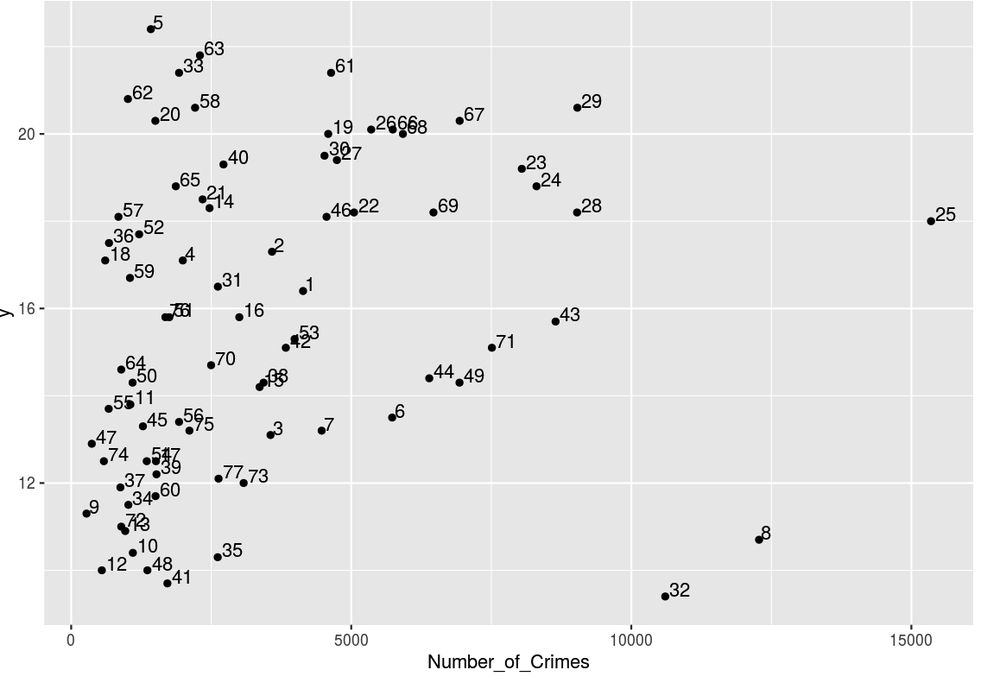
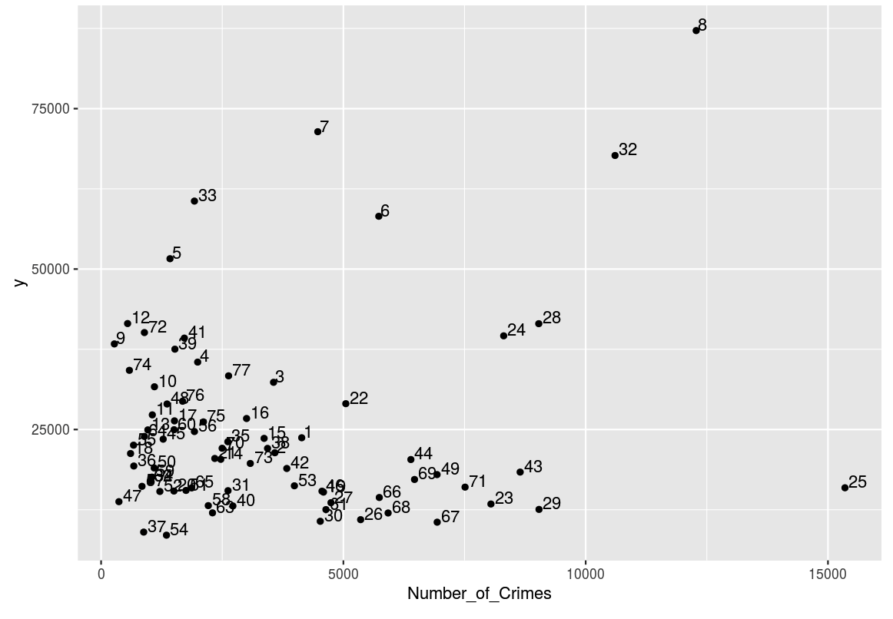
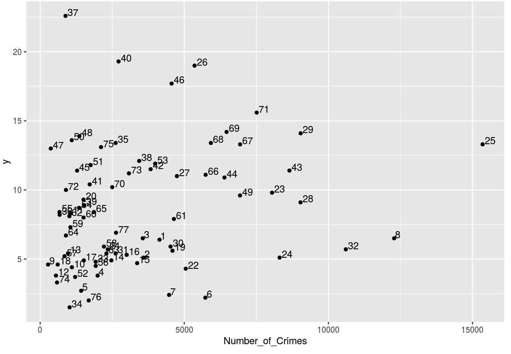
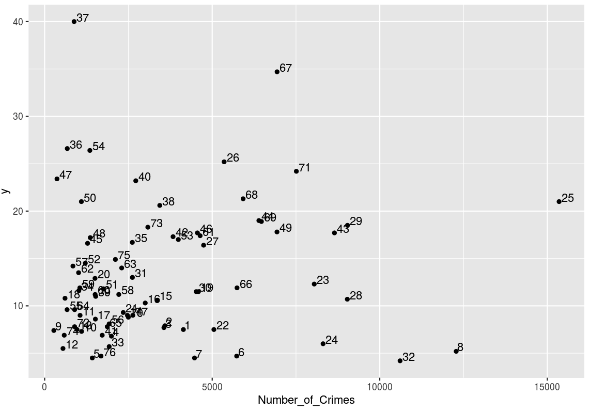
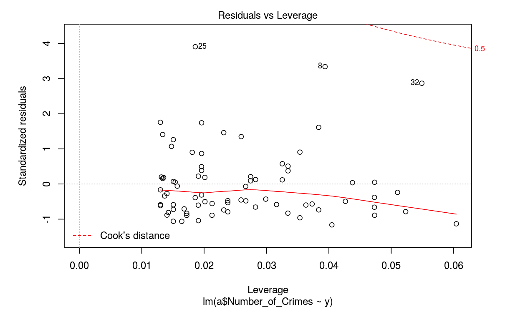
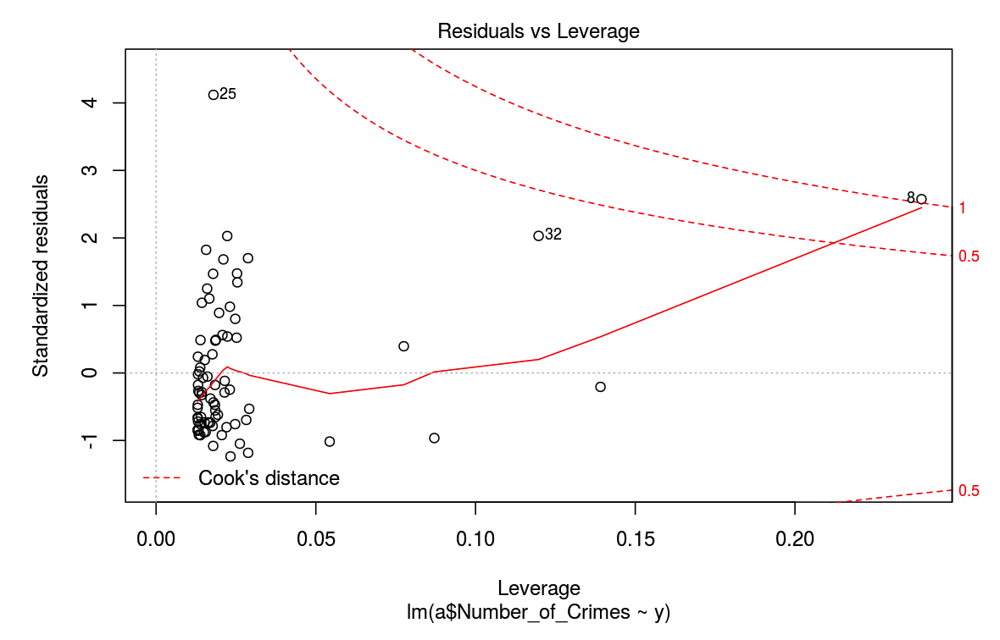
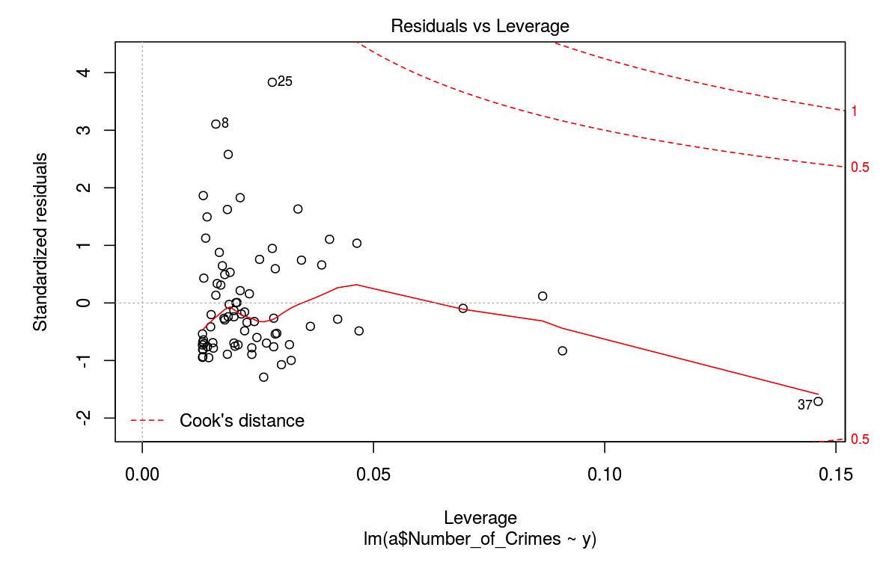
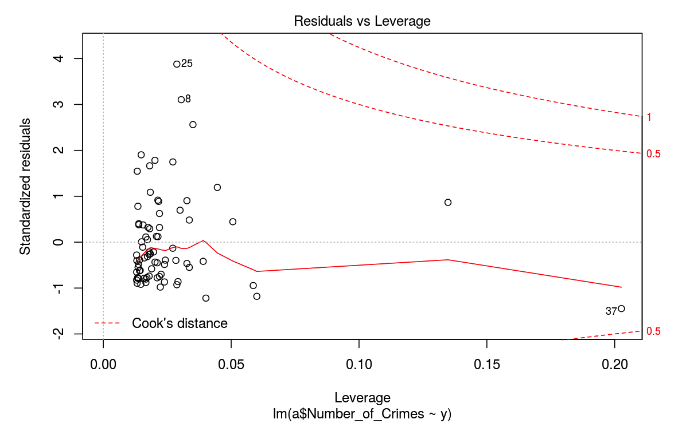

# Introduction

There is an assumption that Socio-economics and Crime rates are closely related. The article, Socioeconomic and demographic factors of crime in Germany Evidence from panel data of the German states by Horst Entorfa and Hannes Spengler, quotes that Modern studies have been stimulated by the dramatic increase of crime rates in western countries, on the one hand, and by recent social and economic problems like unemployment, in particular youth unemployment, migration, and increasing income inequality, on the other. 

Thus, our team will  narrow down various factors of socio-economics such as birth rate, income per capita and infant mortality. And then we will analyze how the number of crime in Chicago is related to each factor of socio-economics based on geographical locations in Chicago. To analyze the datasets, we will combine datasets of socio-economics and crime by one common variable, community area. We will create plots to visualize relationships between socio-economics and crime based on location. 

This topic is interesting and as well as important because the data from US Bureau of the Census shows that the rate of homicide in the United States is much higher than Western Europe. More significantly, finding the relationships would be beneficial to those who are considering to move to Chicago. In addition, based on the analysis, the government and related organizations could improve communities’ livelihood in Chicago with better approaches.

The Shiny App and Regression Model demonstrates both statistical analysis and programming learned from this class.

# Related Work
The study, Socioeconomic and demographic factors of crime in Germany Evidence from panel data of the German state by Horst Entorfa, and Hannes Spengler(2000), was based on Germany and used various factors of socio-economics as well as genders and types of crimes from 1964 to 1996.

However, our team narrows down the factors to birth rate, infant mortality rate and income per capita by community areas in Chicago so that audiences will be able to understand the data graphically.

# Methods

Packages:
The packages we used are “dplyr” for the summarization of data, “rmarkdown” for the demonstration of our analysis process,  “ggplot2” for the visualization of data into graphs, "rvest" for webscraping, "shiny" for web application, "word cloud" to genertae word cloud picture, and "stringr" to wrap strings.

Functions:
Import
"read.csv" is used to import data
"read.html" is used to import link of the website

Tidy
"count()" is used to count the number of crimes in each community area

Transform
"inner_join()" is used to join the table together

Visualize
"geom_point()" is used to plot the scatter plot.
"geom_text()" is used to title the page.
"wordcloud()" is used to create the word cloud image of the graph

Communicate
"citation()" is used to create citations for R packages

# Results

Birth Rate and Community Areas

Income Per Capita and Community Areas

Infant Mortality Rate and Community Areas

Unemployment and Community Areas

Regression: Birth Rate and Community Areas

Regression: Income Per Capita and Community Areas

Regression: Infant Mortality Rate and Community Areas

Regression: Unemployment and Community Areas

# Discussion

The relationship between the socio-economic variables and crime did not show as direct of a relationship as one would think.  The seventy-seven community areas showed regressions that proved that there is no relationship between the two, at least in Chicago community areas.  Income per capita actually showed a slight increasing relationship with crime, opposite to initial our hypothesis.  Similarly, infant mortality rate increased then decreased with higher crime.  Birth rate, which should increase with poverty and therefore with crime, showed little relationship. Unemployment also slightly decreased with additional crime as well. A possible confounder for these relationships is that we did not look at per capita crime data, only raw numbers, so additional analysis might prove otherwise.  These results indicate that the authorities in Chicago should not necessarily focus their efforts on improving the cities’ socio-economic equality by areas of crime.  Since crime is unrelated, the city of Chicago should direct resources to health care, education, and employment in areas that show the worst results in our variables, rather than pumping more money into the police.  A specific example of this is Fuller Park, community area 37.  Fuller park has a relatively low crime rate, however it was also one of the worst neighborhoods in Chicago in terms of unemployment, infant mortality rate, and per capita income.  This low crime statistic does not prove it is a successful neighborhood in Chicago, rather looking at socio-economic variables shows a far more valuable way to show prosperity.  

# Conclusion

This project was an effective way of analyzing the relationship, actually the lack of a relationship, of crime and socio-economic status.  Our initial perceptions of crime and our variables were proved wrong.  The end outcome is that there is now an app which we can interactively explore crime and several variables to see if there is a relationship in future data.  

# Code
The code of this project is included in:
#plot.rmd
#app.R

# Appendix
Variables in dataset this project based on:

ID
Case.number - specific case number for each crime reports
Date - date of crime reported
Block - address where crime reported
Primay.type - types of crime occurred (theft, battery, criminal damage,assault, deceptive practice, other offence)
Description - additional description for crime reports (simple, $500 and under, domestic,to vehicle, to propety, other)
Location.Description - description of locations
Arrest - TRUE/FALSE
Domestic
Beat
District - district numbers in Chicago
Community.Area - community area numbers
Brith.Rate
Community.Area.Name
IUCR - Illinois Uniform Crime Reporting (IUCR) codes
 Assault..Homicide.
 Infant.Mortality.Rate      
 Per.Capita.Income  
Unemployment  

# References

Hadley Wickham, Romain François, Lionel Henry and Kirill Müller (2018). dplyr: A Grammar of Data
  Manipulation. http://dplyr.tidyverse.org, https://github.com/tidyverse/dplyr.

JJ Allaire, Yihui Xie, Jonathan McPherson, Javier Luraschi, Kevin Ushey, Aron Atkins, Hadley Wickham, Joe
  Cheng and Winston Chang (2018). rmarkdown: Dynamic Documents for R. https://rmarkdown.rstudio.com,
  https://github.com/rstudio/rmarkdown.
  
H. Wickham. ggplot2: Elegant Graphics for Data Analysis. Springer-Verlag New York, 2016.

Hadley Wickham (2016). rvest: Easily Harvest (Scrape) Web Pages. R package version 0.3.2.
  https://github.com/hadley/rvest

Winston Chang, Joe Cheng, JJ Allaire, Yihui Xie and Jonathan McPherson (2018). shiny: Web Application
  Framework for R. R package version 1.1.0. http://shiny.rstudio.com

Yihui Xie (2018). knitr: A General-Purpose Package for Dynamic Report Generation in R. R package version
  1.20.

Ian Fellows (2014). wordcloud: Word Clouds. http://blog.fellstat.com/?cat=11 http://www.fellstat.com
  http://research.cens.ucla.edu/.
  
Hadley Wickham (2018). stringr: Simple, Consistent Wrappers for Common String Operations.
  http://stringr.tidyverse.org, https://github.com/tidyverse/stringr.

social economic data:
https://www.healthdata.gov/dataset/census-data-selected-socioeconomic-indicators-chicago-2008-%E2%80%93-2012/resource/7f5ad2d0-afc8

Public health statistics in selected community area in Chicago:
https://data.cityofchicago.org/Health-Human-Services/Public-Health-Statistics-Selected-public-health-in/iqnk-2tcu

